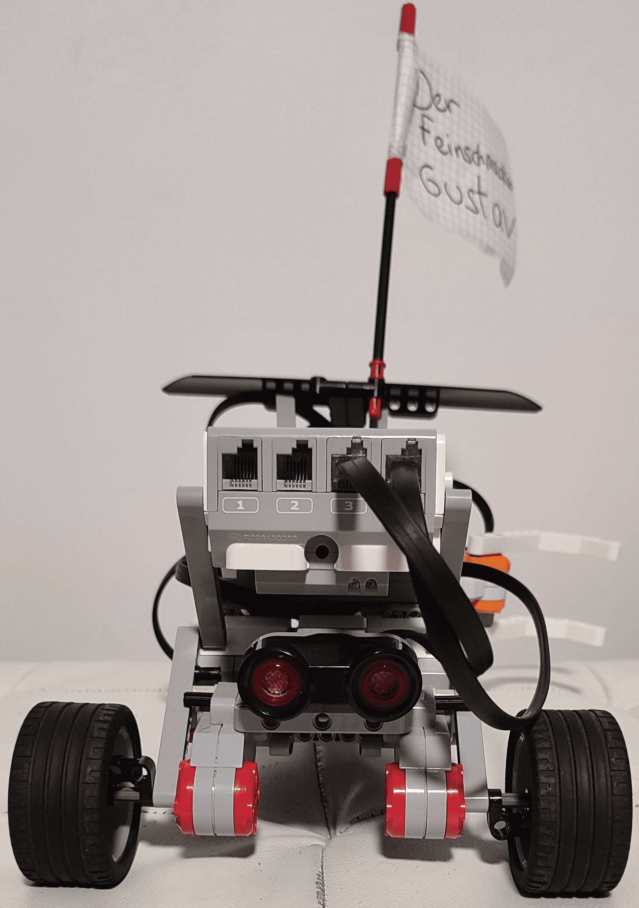
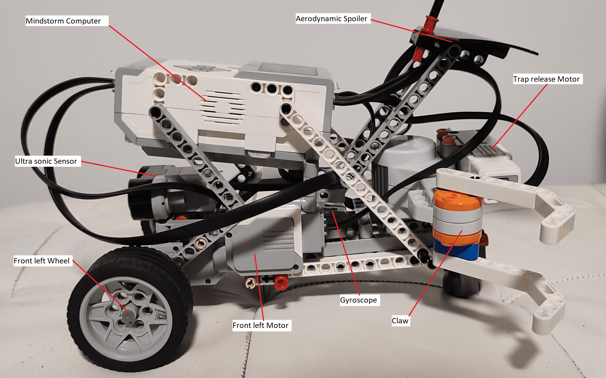
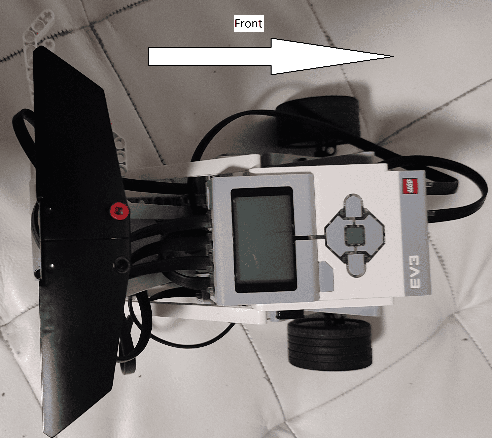

{: .box-note}
Gustave is an ev3 mindstorm robot designed during the OS course. It's purpose is to be put in an arena against another robot. Each robot needs to catch the flag situated in the other part of the arena. 

## Architecture of Gustave

### Four motors are used and 2 sensors

2 motors are used for the 2 front wheels. \
1 motor is used to activate the claw to grab the flag. \
The last motor is used to activate the trap at the back of the robot.

### Annotated pictures of Gustave

Front                                           |  Back
:----------------------------------------------:|:----------------------------------------------:
 | 

Side                                            |  Top
:----------------------------------------------:|:----------------------------------------------:
  | 

## Strategy to win the game

### Rules of the game

The game is taking place in a rectangular arena with a circular obstacle in the middle. The two robots must start in a square on each side. The flags are placed behind the starting point of the robots. 

